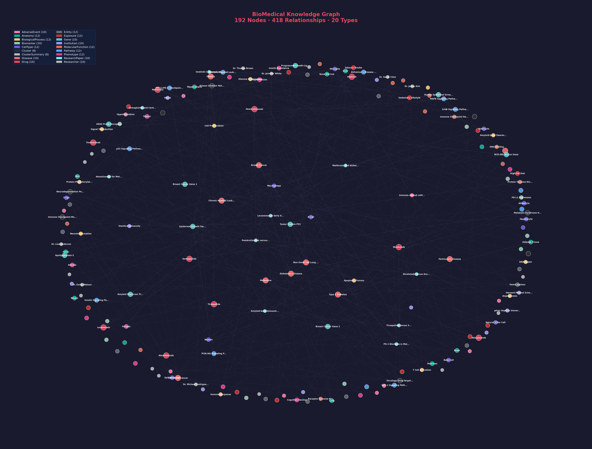

# BioMedical Knowledge Graph Ontology

A comprehensive biomedical knowledge graph with **20 node types**, **30 relationship types**, and **212+ entities** — designed for GraphRAG-powered biomedical question answering, drug discovery, and clinical research intelligence.



## Overview

This project provides:
- **Curated biomedical ontology** covering drugs, diseases, genes, proteins, pathways, clinical trials, and more
- **CSV-based data** ready for import into Neo4j, Amazon Neptune, or any graph database
- **Knwler integration** for automated entity extraction from biomedical PDFs
- **Visualization tools** generating interactive HTML reports and high-resolution graph images
- **Neo4j Cypher scripts** for one-command graph database loading

## Graph Schema

```
┌──────────────────────────────────────────────────────────────────┐
│                    20 NODE TYPES                                   │
├──────────────────────────────────────────────────────────────────┤
│ Drug · Disease · Gene · Protein · Biomarker · ClinicalTrial      │
│ Researcher · Institution · AdverseEvent · ResearchPaper          │
│ Pathway · Anatomy · CellType · BiologicalProcess                 │
│ MolecularFunction · Entity · Exposure · Phenotype                │
│ Cluster · ClusterSummary                                         │
└──────────────────────────────────────────────────────────────────┘

┌──────────────────────────────────────────────────────────────────┐
│                    30 RELATIONSHIP TYPES                           │
├──────────────────────────────────────────────────────────────────┤
│ TREATS · TARGETS · ASSOCIATED_WITH · PREDICTS_RESPONSE           │
│ INVESTIGATES · STUDIES · REPORTS · SPONSORS · AUTHORED_BY        │
│ MENTIONS · AFFILIATED_WITH · PARTICIPATES_IN · INVOLVED_IN       │
│ REGULATES · HAS_FUNCTION · EXPRESSED_IN · AFFECTS · FOUND_IN    │
│ INVOLVES · HAS_SUMMARY · HAS_PHENOTYPE · INCREASES_RISK         │
│ BELONGS_TO · and more...                                         │
└──────────────────────────────────────────────────────────────────┘
```

## Project Structure

```
BioMedical_KnowledgeGraph/
├── nodes/                          # Node CSV files (20 types)
│   ├── drugs.csv                   # 10 drugs (immunotherapy, small molecules, peptides)
│   ├── diseases.csv                # 10 diseases (oncology, metabolic, neurology)
│   ├── genes.csv                   # Genes with chromosomal locations
│   ├── proteins.csv                # Proteins with UniProt IDs
│   ├── biomarkers.csv              # Clinical biomarkers
│   ├── clinical_trials.csv         # Clinical trials with NCT IDs
│   ├── researchers.csv             # Research investigators
│   ├── institutions.csv            # Research institutions
│   ├── adverse_events.csv          # Drug adverse events
│   ├── research_papers.csv         # Published papers with DOIs
│   ├── pathways.csv                # Biological pathways (KEGG)
│   ├── anatomy.csv                 # Anatomical structures (UBERON)
│   ├── cell_types.csv              # Cell types (Cell Ontology)
│   ├── biological_processes.csv    # GO biological processes
│   ├── molecular_functions.csv     # GO molecular functions
│   ├── entities.csv                # Organisms & pathogens
│   ├── exposures.csv               # Environmental risk factors
│   ├── phenotypes.csv              # Clinical phenotypes (HPO)
│   ├── clusters.csv                # Graph community clusters
│   └── cluster_summaries.csv       # AI-generated cluster summaries
│
├── relationships/                  # Relationship CSV files (30 types)
│   ├── drug_treats_disease.csv
│   ├── drug_targets_protein.csv
│   ├── gene_associated_with_disease.csv
│   ├── biomarker_predicts_response.csv
│   ├── trial_investigates_drug.csv
│   ├── trial_studies_disease.csv
│   ├── trial_reports_adverse_event.csv
│   ├── institution_sponsors_trial.csv
│   ├── paper_authored_by.csv
│   ├── paper_mentions_disease.csv
│   ├── paper_mentions_drug.csv
│   ├── researcher_affiliated_with.csv
│   ├── gene_participates_in_pathway.csv
│   ├── protein_involved_in_pathway.csv
│   ├── pathway_involves_biological_process.csv
│   ├── gene_involved_in_biological_process.csv
│   ├── protein_involved_in_biological_process.csv
│   ├── gene_has_molecular_function.csv
│   ├── protein_has_molecular_function.csv
│   ├── protein_expressed_in_anatomy.csv
│   ├── disease_affects_anatomy.csv
│   ├── cell_type_found_in_anatomy.csv
│   ├── disease_involves_cell_type.csv
│   ├── cluster_has_summary.csv
│   ├── disease_has_phenotype.csv
│   ├── exposure_increases_risk_disease.csv
│   ├── exposure_affects_gene.csv
│   ├── entity_associated_with_disease.csv
│   ├── phenotype_associated_with_gene.csv
│   └── node_belongs_to_cluster.csv
│
├── scripts/                        # Automation scripts
│   ├── neo4j_load_complete_graph.cypher    # Full Neo4j load script
│   ├── knwler_integration.py               # Knwler → KG CSV mapper
│   ├── run_knwler_pipeline.py              # End-to-end extraction pipeline
│   ├── export_to_knwler.py                 # CSV → Knwler graph.json exporter
│   ├── generate_graph_image.py             # PNG image generator
│   ├── fix_graph_json.py                   # Knwler format converter
│   └── README_KNWLER_INTEGRATION.md        # Knwler integration docs
│
├── visualization/                  # Generated outputs
│   ├── BioMedical_KG.png           # High-res graph image
│   ├── graph.json                  # Knwler-compatible graph data
│   └── index.html                  # Interactive HTML visualization
│
├── requirements.txt                # Python dependencies
└── README.md                       # This file
```

## Quick Start

### 1. Clone & Install

```bash
git clone https://github.com/Ramu-DE/BioMedical_KnowledgeGraph_ontology.git
cd BioMedical_KnowledgeGraph_ontology
pip install -r requirements.txt
```

### 2. Load into Neo4j

Copy all CSV files to Neo4j's `import/` directory, then run:

```cypher
// In Neo4j Browser, paste the contents of:
// scripts/neo4j_load_complete_graph.cypher
```

Or via command line:
```bash
# Copy data to Neo4j import folder
cp nodes/*.csv /path/to/neo4j/import/
cp -r relationships/ /path/to/neo4j/import/

# Run the Cypher script
cat scripts/neo4j_load_complete_graph.cypher | cypher-shell -u neo4j -p password
```

### 3. Visualize the Graph

```bash
# Generate high-res PNG image
python scripts/generate_graph_image.py

# Generate interactive HTML (requires knwler)
python scripts/export_to_knwler.py --open
```

### 4. Extract from New Documents (Knwler Integration)

```bash
# Install Knwler
pipx install knwler

# Process a biomedical PDF and add to the graph
python scripts/run_knwler_pipeline.py --file paper.pdf --backend openai --use-schema

# Or with local LLM (air-gapped, no data leaves machine)
python scripts/run_knwler_pipeline.py --file paper.pdf --backend ollama
```

## Node Types Detail

| # | Node Type | Count | Key Fields | Ontology Source |
|---|-----------|-------|------------|-----------------|
| 1 | Drug | 10 | drug_id, name, mechanism, drug_type | DrugBank |
| 2 | Disease | 10 | disease_id, name, icd10_code, category | ICD-10 |
| 3 | Gene | 10 | gene_id, symbol, chromosome, function | HGNC |
| 4 | Protein | 10 | protein_id, name, uniprot_id, protein_class | UniProt |
| 5 | Biomarker | 10 | biomarker_id, name, type, clinical_significance | — |
| 6 | ClinicalTrial | 10 | trial_id, nct_id, phase, status | ClinicalTrials.gov |
| 7 | Researcher | 10 | researcher_id, name, specialization, h_index | — |
| 8 | Institution | 10 | institution_id, name, type, country | — |
| 9 | AdverseEvent | 10 | event_id, name, severity, category | MedDRA |
| 10 | ResearchPaper | 10 | paper_id, title, journal, doi | PubMed |
| 11 | Pathway | 10 | pathway_id, name, kegg_id, category | KEGG |
| 12 | Anatomy | 12 | anatomy_id, name, uberon_id, system | UBERON |
| 13 | CellType | 10 | cell_type_id, name, cell_ontology_id | Cell Ontology |
| 14 | BiologicalProcess | 10 | process_id, name, go_id, category | Gene Ontology |
| 15 | MolecularFunction | 10 | function_id, name, go_id, category | Gene Ontology |
| 16 | Entity | 12 | entity_id, name, entity_type, source | NCBI Taxonomy |
| 17 | Exposure | 12 | exposure_id, name, exposure_type, risk_level | IARC/WHO |
| 18 | Phenotype | 12 | phenotype_id, name, hpo_id, category | HPO |
| 19 | Cluster | 8 | cluster_id, name, cluster_type, algorithm | GraphRAG |
| 20 | ClusterSummary | 8 | summary_id, summary_text, key_entities | GraphRAG |

## Architecture

```
┌─────────────────────────────────────────────────────────┐
│  Data Sources (PDFs, Papers, Clinical Data)              │
└──────────────────────────┬──────────────────────────────┘
                           │ Knwler extraction
                           ▼
┌─────────────────────────────────────────────────────────┐
│  CSV Data Layer (nodes/ + relationships/)                 │
│  Curated ontology with 20 types, 30 relationships        │
└──────────────────────────┬──────────────────────────────┘
                           │ Cypher / Bulk Load
                           ▼
┌─────────────────────────────────────────────────────────┐
│  Graph Database (Neo4j / Amazon Neptune)                  │
│  openCypher queries, SPARQL, Gremlin                     │
└──────────────────────────┬──────────────────────────────┘
                           │
              ┌────────────┼────────────┐
              ▼            ▼            ▼
┌──────────────┐  ┌──────────────┐  ┌──────────────────┐
│ Graph        │  │ GraphRAG     │  │ Visualization    │
│ Analytics    │  │ (LLM +       │  │ (Knwler HTML,    │
│ (Community,  │  │  Graph       │  │  matplotlib,     │
│  PageRank)   │  │  Retrieval)  │  │  Neo4j Browser)  │
└──────────────┘  └──────────────┘  └──────────────────┘
```

## Use Cases

- **Drug Discovery**: Traverse drug → protein → pathway → disease connections
- **Clinical Trial Intelligence**: Find trials by disease, drug, institution
- **Biomarker Identification**: Link biomarkers to drug response predictions
- **Adverse Event Analysis**: Map drugs to reported adverse events via trials
- **Literature Mining**: Extract and link entities from research papers
- **Risk Factor Analysis**: Connect environmental exposures to disease risk via gene mutations

## Knwler Integration

This project integrates with [Knwler](https://knwler.com/) for automated knowledge extraction from biomedical documents. See [scripts/README_KNWLER_INTEGRATION.md](scripts/README_KNWLER_INTEGRATION.md) for full documentation.

Key features:
- Automatic entity type mapping (Knwler types → BioMedical KG ontology)
- Deduplication against existing nodes
- Air-gapped operation with local LLMs (Ollama)
- Batch processing for large document sets

## Amazon Neptune Deployment

For AWS deployment, the CSV format is compatible with Neptune's bulk loader:

```bash
# Convert to Neptune format
knwler graph convert --format jsonld

# Or use the Cypher script with Neptune's openCypher support
# Neptune supports the same openCypher syntax as Neo4j
```

## License

MIT

## Contributing

1. Fork the repository
2. Add new node/relationship CSVs following existing patterns
3. Update `neo4j_load_complete_graph.cypher` with new types
4. Run `python scripts/generate_graph_image.py` to update visualization
5. Submit a pull request
